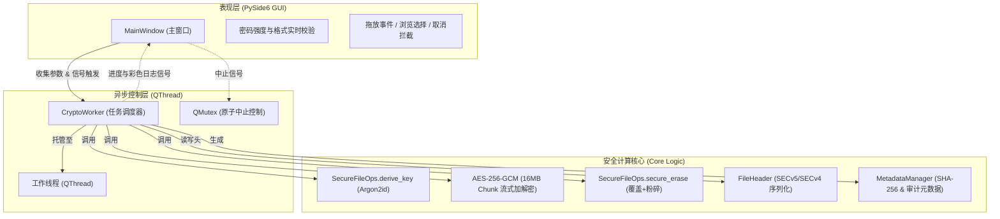

# VanishCrypt

<p align="center">
  <strong>基于 PySide6 的现代化高强度 AES-256-GCM 文件加密与安全擦除工具</strong>
</p>

<p align="center">
  <a href="https://www.python.org/downloads/"></a>
  <a href="https://pypi.org/project/PySide6/"></a>
  <a href="https://cryptography.io/"></a>
  <a href="https://github.com/P-H-C/phc-winner-argon2"></a>
  <a href="LICENSE"></a>
  
</p>

<p align="center">
  <a href="README.md"><strong>简体中文</strong></a> •
  <a href="README_en.md"><strong>English</strong></a>
</p>

---

## 📖 项目简介

**VanishCrypt** 是一款注重隐私与数据安全的高强度文件加密解密桌面工具。

在传统的文件加密场景中，加密软件往往仅生成加密后的副本，而将包含敏感信息的原始明文文件留存在存储介质中，极易被数据恢复工具还原。VanishCrypt 在完成 **AES-256-GCM 认证加密** 的同时，对原文件执行**深度安全擦除**（断开文件名索引 + AES-GCM 密文流覆写 + 双重随机临时文件粉碎），确保敏感数据“加密即消失，无法逆向恢复”。

同时，VanishCrypt 采用顶级抗暴力破解的 **Argon2id** 密钥派生算法（分配 1GB 运行内存参数），并提供基于 **PySide6** 的现代化深色主题界面，支持文件批量拖放、实时进度与日志监控、全流程异常安全防护与随时中断取消机制。

---

## ✨ 核心特性

| 功能模块 | 特性描述 |
| :--- | :--- |
| 🔐 **AES-256-GCM 认证加密** | 采用工业级 AEAD 认证加密算法，在提供最高等级机密性的同时，内置 128-bit 认证标签（Tag）杜绝任何形式的数据篡改。 |
| 🛡️ **高强度 Argon2id 密钥派生** | 配置内存硬化参数（`time_cost=12`, `memory_cost=1GB`, `parallelism=8`），彻底防御 GPU、FPGA 和 ASIC 定制硬件的离线暴力破解。 |
| 🗑️ **SSD 优化原位安全擦除** | 断开路径索引 → `r+b` 原位流式随机字节覆写 → `fsync` 强制物理落盘 → 二次重命名粉碎。支持可选是否安全粉碎原文件。 |
| 📋 **交互式多文件队列** | 表格化展示文件名、体积、状态及单项移除操作；支持拖拽追加去重、总容量统计与一键清空。 |
| 📁 **独立文件夹与批量递归** | 提供“添加文件”与“添加文件夹”独立入口，支持深层目录递归扫描并计算文件级 SHA-256 指纹。 |
| 🎲 **内置强密码生成器** | 一键生成 16 位高强度随机密码并自动写入剪贴板；配备实时 Caps Lock 大写锁定检测预警。 |
| 📊 **双进度条与速率预估** | 细粒度分别呈现“当前单文件”与“总体批处理”进度，实时反馈处理速度（MB/s）与预估剩余时间（ETA）。 |
| 💾 **磁盘空间安全预检** | 任务执行前自动预估并核查目标磁盘剩余容量（含安全冗余缓冲），防止因磁盘写满引发崩溃。 |
| ⚡ **多线程异步与安全取消** | 底层计算与 UI 线程隔离（`QThread`），支持随时点击“取消操作”并安全回滚，不阻塞界面。 |
| 🔄 **V5 自描述格式与 V4 兼容** | 采用全新 `SECv5` 文件头，嵌入 KDF 派生参数支持未来升级；同时全自动识别并兼容解密 `SECv4` 历史文件。 |
| 🔒 **内存与权限防御** | 派生密钥采用可变 `bytearray` 存储并在使用后立即覆零清空；生成文件权限默认设为严苛的 `0o600`。 |

---

## 🔒 安全设计与威胁模型

### 1. 密钥生命周期管理
- 用户输入的口令在 Python 内存中完成 Argon2id 派生为 32 字节（256 位）对称密钥。
- 密钥统一存放在 Python `bytearray` 结构中。无论是加密还是解密流程，一旦数据流处理完毕或发生异常，立即触发 `SecureFileOps.wipe_key()` 对底层内存逐字节写入 `0x00`。

### 2. 抗篡改与完整性校验（AEAD）
- 加密时在密文末尾生成 16 字节的 GCM Authentication Tag，并回填至文件头部。
- 解密时若口令错误或文件内容发生 1 个 bit 的意外篡改/恶意注入，底层密码学引擎将立即抛出 `InvalidTag` 异常并中止解密，严防密文篡改注入攻击。

### 3. 原子写入与故障恢复
- 加解密过程均在临时文件（`.tmp_[随机8位hex]`）中完成，完全成功并写回 Tag 后，通过 `os.replace()` 原子性替换为目标文件名。
- 若处理过程中用户主动点击“取消”或发生 I/O 错误，程序会自动拦截异常并清理未完成的临时残留文件，绝不会留下损坏的半截文件。

### 4. SSD 安全擦除原理与局限
- **擦除流程**：
  1. `os.replace(file_path, tmp_src)`：将原文件原子重命名为随机名，切断原文件名索引与目录项关联。
  2. 以 `r+b` 原位读写模式打开 `tmp_src`，用高强度随机密码学字节流完整覆写原始物理存储数据块。
  3. 执行 `f.flush()` 与 `os.fsync(fileno)` 强制绕过操作系统写缓存，将覆写数据物理落盘至存储芯片。
  4. 二次原子重命名为全新随机临时文件 `tmp_dst`，抹除一切元数据轨迹后执行 `os.remove()`。
- **物理局限说明**：
  > [!WARNING]
  > 由于现代 SSD 具备复杂的磨损均衡（Wear Leveling）和垃圾回收（Garbage Collection / FTL）机制，纯软件层面的写入覆盖无法 100% 保证底层所有闪存物理单元完全被擦除。对于极高威胁等级的场景，强烈建议将本工具配合操作系统全盘加密（如 Windows BitLocker / Linux LUKS / macOS FileVault）共同使用。

---

## 📄 二进制文件格式说明

VanishCrypt 采用自描述型二进制文件头结构，确保未来即便调整密码学强度参数，旧文件依然能被无缝解析。

### V5 格式 (`SECv5`) — 当前版本

```
+---------------+---------------+---------------+-------------------+---------------+--------------------+
|   MAGIC (5B)  |   Salt (16B)  |   Nonce (12B) |  KDF Params (12B) |   Tag (16B)   |  Encrypted Data... |
+---------------+---------------+---------------+-------------------+---------------+--------------------+
```

| 偏移量 (Offset) | 字节大小 (Size) | 字段名称 (Field) | 类型 (Type) | 说明 (Description) |
| :---: | :---: | :--- | :--- | :--- |
| `0x00` | 5 字节 | `MAGIC` | ASCII 字符串 | 固定为 `SECv5`，用于格式标识 |
| `0x05` | 16 字节 | `salt` | 二进制流 | Argon2id 派生随机盐值，每个文件独一无二 |
| `0x15` | 12 字节 | `nonce` | 二进制流 | AES-256-GCM 初始向量（IV / Nonce） |
| `0x21` | 4 字节 | `time_cost` | uint32 (Big-Endian) | Argon2id 迭代时间开销（默认: `12`） |
| `0x25` | 4 字节 | `memory_cost` | uint32 (Big-Endian) | Argon2id 内存开销（默认: `1,048,576` KB / 1GB） |
| `0x29` | 4 字节 | `parallelism` | uint32 (Big-Endian) | Argon2id 并行线程数（默认: `8`） |
| `0x2D` | 16 字节 | `GCM tag` | 二进制流 | AES-256-GCM 消息认证标签 |
| `0x3D` | 可变长度 | `Ciphertext` | 二进制流 | 采用 16 MB 分块流式加密的文件主体密文 |

**文件头总长度：61 字节**

### V4 格式 (`SECv4`) — 兼容读取

当识别到文件头部为 `SECv4`（总长度 49 字节）时，程序自动回落到内置的硬编码参数派生密钥，确保旧版本加密的文件无需人工干预即可顺利解密。

---

## 🚀 安装与运行

### 环境要求

- **Python**: $\ge$ 3.10
- **操作系统**: Windows 10/11、macOS 12+、Linux (主流发行版)

### 1. 克隆代码仓库

```bash
git clone https://github.com/TheBitGlow/VanishCrypt.git
cd VanishCrypt
```

### 2. 创建并激活虚拟环境（推荐）

- **Windows (PowerShell)**:
  ```powershell
  python -m venv venv
  .\venv\Scripts\Activate.ps1
  ```
- **Linux / macOS**:
  ```bash
  python3 -m venv venv
  source venv/bin/activate
  ```

### 3. 安装依赖库

```bash
pip install -r requirements.txt
```

> **核心依赖清单**：
> - `PySide6 >= 6.5`：跨平台现代化 Qt GUI 框架
> - `cryptography >= 41.0`：底层高性能 AES-GCM 加密引擎
> - `argon2-cffi >= 23.1`：抗 GPU 暴力破解的 Argon2id 密码哈希实现

### 4. 启动程序

```bash
python VanishCrypt.py
```

---

## 🖥️ 使用指南

```
┌─────────────────────────────────────────────────────────────┐
│  VanishCrypt — AES-GCM 加密解密                             │
├─────────────────────────────────────────────────────────────┤
│  选择文件: [ 拖放文件到此处或点击「浏览」按钮... ]  [ 浏览… ] │
│  输入密码: [ ***************** ]              [x] 显示密码  │
│  确认密码: [ ***************** ]                            │
│                                           密码强度: 强 (绿) │
│  [     加密文件     ]  [     解密文件     ]  [  取消操作  ] │
│ ┌─────────────────────────────────────────────────────────┐ │
│ │ ℹ️ 元数据信息: 操作 encrypt, 文件数 3                   │ │
│ │ ℹ️ 安全删除原文件: contract.pdf                          │ │
│ │ ✅ contract.pdf → contract.pdf.secure                   │ │
│ └─────────────────────────────────────────────────────────┘ │
│  [========================== 100% ========================] │
└─────────────────────────────────────────────────────────────┘
```

### 文件加密流程
1. **添加目标**：点击「**浏览…**」按钮选取文件，或直接从桌面/文件夹**拖放文件/目录**至主窗口。
2. **设置口令**：在「**输入密码**」框内输入强密码（需满足 12 字符以上且包含大小写、数字与特殊字符）。下方强度指示器变为**绿色“密码强度: 强”**。
3. **确认口令**：在「**确认密码**」框内再次输入相同密码。
4. **触发加密**：点击「**加密文件**」，在弹出的高危警示窗口中仔细核对后点击「**Yes**」。
5. **后台处理**：程序自动计算原文件 SHA-256，生成 `.secure` 加密文件，并对原文件执行安全覆写粉碎。

### 文件解密流程
1. **载入密文**：选择或拖放待解密的 `.secure` 文件。
2. **输入口令**：输入加密时使用的口令（解密时无需二次确认）。
3. **触发解密**：点击「**解密文件**」并在确认窗口点击「**Yes**」。
4. **校验还原**：GCM 认证标签验证通过后，还原出明文文件，并安全擦除密文文件。
   > [!NOTE]
   > 如果解密目标路径已存在同名文件，程序会自动重命名为 `文件名_1.ext`，绝不覆盖已有数据。

---

## 📐 系统架构与模块划分



---

## ❓ 常见问题 (FAQ)

### Q1: 为什么批量处理大量小文件时感觉有轻微延迟？
**答**：这是高安全级的**刻意设计**。VanishCrypt 为每个文件生成完全独立的 16 字节随机 Salt，并执行一次高强度的 Argon2id 计算（`1GB 内存` + `12 轮迭代`）。在现代多核处理器上单次派生大约耗时 0.5 ~ 1.5 秒。这种设计让攻击者无法使用彩虹表，且破解单个文件的成本无法平摊到其他文件。

### Q2: 提示“密码验证失败：密码错误或文件已被篡改”代表什么？
**答**：AES-GCM 是认证加密（AEAD）。这代表解密运算后计算出的认证标签与文件头中的 GCM Tag 不匹配。原因只有两种：
1. 输入了错误的密码；
2. 加密文件在传输或存储过程中损坏，或遭到了恶意第三方的人为篡改。VanishCrypt 会拒绝输出任何损坏数据。

### Q3: 运行中点击“取消操作”安全吗？
**答**：绝对安全。VanishCrypt 内置基于 `QMutex` 的线程安全标志位检查机制。在读取每个 16MB 数据块时都会检测中止请求。取消后，正在处理的文件对应的未完成临时文件会被立即彻底清理，既不会破坏原文件，也不会留下脏数据。

---

## 📄 开源许可证

本项目遵循 [MIT 许可证](LICENSE) 开源。您可以自由地使用、修改和分发本项目。

> **免责声明 (Disclaimer)**：
> 加密与粉碎操作具有不可逆性。请务必牢记您的密码，密码丢失将导致数据永久不可找回；在进行任何大规模批量操作前，建议先行测试。作者不对因遗忘密码或软硬件异常造成的数据丢失承担责任。
