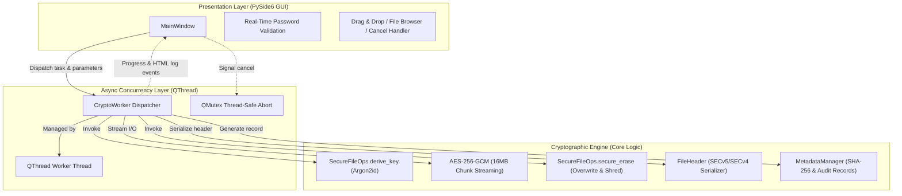

# VanishCrypt

<p align="center">
  <strong>Modern, High-Security AES-256-GCM File Encryption & Secure Erase Tool powered by PySide6</strong>
</p>

<p align="center">
  <a href="https://www.python.org/downloads/"></a>
  <a href="https://pypi.org/project/PySide6/"></a>
  <a href="https://cryptography.io/"></a>
  <a href="https://github.com/P-H-C/phc-winner-argon2"></a>
  <a href="LICENSE"></a>
  
</p>

<p align="center">
  <a href="README_en.md"><strong>English</strong></a> •
  <a href="README.md"><strong>简体中文</strong></a>
</p>

---

## 📖 Overview

**VanishCrypt** is a privacy-first desktop utility engineered for uncompromising file encryption and irreversible shredding.

Conventional file encryption tools typically produce an encrypted clone while leaving the original plaintext file intact on disk. This leaves residual data vulnerable to file carvers and forensic undelete tools. VanishCrypt pairs **AES-256-GCM authenticated encryption** with **SSD-optimized multi-stage secure wiping** (index detachment + AES-GCM ciphertext stream overwriting + dual randomized temporary file shredding). When you encrypt a file, the original is wiped down to unrecoverable noise.

To defend against offline GPU/ASIC brute-force dictionary attacks, VanishCrypt employs **Argon2id** key derivation with memory-hard parameters (allocating **1 GB RAM** per derivation). Built on **PySide6**, it features a clean dark-themed GUI, batch processing, drag-and-drop support, real-time logging, atomic operations, and cancellation safeguards.

---

## ✨ Key Features

| Feature | Description |
| :--- | :--- |
| 🔐 **AES-256-GCM AEAD Encryption** | Military-grade authenticated encryption guaranteeing both confidentiality and integrity with a 128-bit authentication tag. |
| 🛡️ **Hardened Argon2id KDF** | Memory-hard key derivation (`time_cost=12`, `memory_cost=1GB`, `parallelism=8`) designed to neutralize GPU, FPGA, and ASIC cracking clusters. |
| 🗑️ **SSD-Optimized Secure Wipe** | Detaches filename directory references → overwrites original contents with random-key AES ciphertext stream → unlinks dual temporary artifacts. |
| 📁 **Batch & Recursive Folders** | Select individual files or drag-and-drop entire folders. Automatically walks directory trees and computes SHA-256 fingerprints. |
| 🖱️ **Drag-and-Drop Workflow** | Effortlessly drag single files, batches, or folders directly into the application window. |
| 🔑 **Enforced Password Policy** | Strictly mandates $\ge 12$ characters containing uppercase, lowercase, numbers, and symbols, with a real-time reactive strength meter. |
| 🛡️ **Fail-Safe Double Confirmation** | Password confirmation field during encryption and mandatory modal alerts to guard against accidental shredding. |
| ⚡ **Async Multi-Threading & Safe Cancel** | Decoupled UI and worker threads (`QThread`). Cooperative `QMutex` thread-safe cancellation enables instant abort without leaving corrupted files. |
| 🔄 **Self-Describing V5 Format & V4 Back-Compat** | `SECv5` embeds KDF parameters inside the header for future cryptographic agility, while seamlessly decrypting legacy `SECv4` containers. |
| 🔒 **Memory & Permission Hardening** | Encryption keys reside in mutable `bytearray` buffers wiped with zeroes immediately after use. Output files are restricted to permissions `0o600`. |

---

## 🔒 Security Architecture & Threat Model

### 1. Cryptographic Key Lifecycle
- User-supplied master passwords are fed directly into the Argon2id KDF with a cryptographically secure 16-byte random salt to produce a 32-byte (256-bit) symmetric key.
- Derived keys are stored strictly inside mutable Python `bytearray` instances. Once file operations complete (or if an unexpected error occurs), `SecureFileOps.wipe_key()` explicitly zeroes all memory bytes (`0x00`).

### 2. Anti-Tamper & AEAD Integrity Verification
- AES-GCM generates a 16-byte authentication tag over the entire data stream, which is written to the file header.
- During decryption, if a single bit of the ciphertext has been flipped or if an invalid password is entered, the underlying cryptographic engine raises an `InvalidTag` exception. Decryption aborts instantly, preventing malicious plaintext execution or corrupted output.

### 3. Atomic Operations & Failure Invariance
- Encryption and decryption operate through uniquely randomized temporary files (`.tmp_[8-hex-token]`).
- The output file is only published once the stream is completely flushed and authenticated, using `os.replace()` for atomic substitution.
- If a user cancels or an I/O exception occurs, all temporary files are unlinked automatically, leaving existing files intact.

### 4. SSD Secure Shredding & Threat Model
- **Wiping Workflow**:
  1. `os.replace(file_path, tmp_src)`: Atomically breaks the original file inode/directory link.
  2. A fresh, ephemeral 256-bit key and 96-bit nonce are generated. The source is read in 16 MB chunks, encrypted with AES-GCM, and written to `tmp_enc`.
  3. Both `tmp_src` and `tmp_enc` are removed from the filesystem.
- **Physical Limitations of Flash Storage**:
  > [!WARNING]
  > Solid-state drives (SSDs) utilize wear-leveling algorithms and Flash Translation Layers (FTL). Software-level overwriting cannot guarantee that every physical NAND flash block is updated in place. For maximum protection in hostile threat environments, use VanishCrypt in conjunction with Full Disk Encryption (such as BitLocker, LUKS, or FileVault).

---

## 📄 Binary File Format Specification

VanishCrypt uses an extensible, self-describing binary container format to ensure long-term decryptability even if default KDF parameters change over time.

### V5 Format (`SECv5`) — Current Specification

```
+---------------+---------------+---------------+-------------------+---------------+--------------------+
|   MAGIC (5B)  |   Salt (16B)  |   Nonce (12B) |  KDF Params (12B) |   Tag (16B)   |  Encrypted Data... |
+---------------+---------------+---------------+-------------------+---------------+--------------------+
```

| Offset | Size | Field | Type | Description |
| :---: | :---: | :--- | :--- | :--- |
| `0x00` | 5 bytes | `MAGIC` | ASCII String | Identifier constant: `SECv5` |
| `0x05` | 16 bytes | `salt` | Binary Bytes | Random cryptographic salt for Argon2id |
| `0x15` | 12 bytes | `nonce` | Binary Bytes | AES-256-GCM Initialization Vector (96-bit Nonce) |
| `0x21` | 4 bytes | `time_cost` | uint32 (Big-Endian) | Argon2id iteration count (Default: `12`) |
| `0x25` | 4 bytes | `memory_cost` | uint32 (Big-Endian) | Argon2id memory limit in KiB (Default: `1,048,576` / 1GB) |
| `0x29` | 4 bytes | `parallelism` | uint32 (Big-Endian) | Argon2id thread lanes (Default: `8`) |
| `0x2D` | 16 bytes | `GCM tag` | Binary Bytes | 128-bit AES-GCM message authentication tag |
| `0x3D` | Variable | `Ciphertext` | Binary Bytes | Payload encrypted in 16 MB streaming blocks |

**Total Header Size: 61 Bytes**

### V4 Format (`SECv4`) — Backward Compatibility

When `SECv4` headers (49 bytes) are encountered, VanishCrypt automatically reads the container using legacy default KDF constants, ensuring seamless backward compatibility without manual configuration.

---

## 🚀 Installation & Quick Start

### Prerequisites

- **Python**: $\ge$ 3.10
- **Operating System**: Windows 10/11, macOS 12+, or modern Linux distributions

### 1. Clone the Repository

```bash
git clone https://github.com/TheBitGlow/VanishCrypt.git
cd VanishCrypt
```

### 2. Create & Activate Virtual Environment (Recommended)

- **Windows (PowerShell)**:
  ```powershell
  python -m venv venv
  .\venv\Scripts\Activate.ps1
  ```
- **Linux / macOS**:
  ```bash
  python3 -m venv venv
  source venv/bin/activate
  ```

### 3. Install Required Dependencies

```bash
pip install -r requirements.txt
```

> **Core Dependencies**:
> - `PySide6 >= 6.5`: Modern, responsive desktop GUI framework.
> - `cryptography >= 41.0`: High-performance AES-GCM primitives.
> - `argon2-cffi >= 23.1`: Memory-hard Argon2id implementation.

### 4. Launch Application

```bash
python VanishCrypt.py
```

---

## 🖥️ Usage Guide

```
┌─────────────────────────────────────────────────────────────┐
│  VanishCrypt — AES-GCM Encryption / Decryption              │
├─────────────────────────────────────────────────────────────┤
│  Select File: [ Drag & drop files or click Browse...     ] [ Browse… ] │
│  Password:    [ ***************** ]              [x] Show Password  │
│  Confirm:     [ ***************** ]                         │
│                                       Password Strength: Strong (Green)│
│  [     Encrypt Files     ]  [     Decrypt Files     ]  [  Cancel  ] │
│ ┌─────────────────────────────────────────────────────────┐ │
│ │ ℹ️ Metadata: Operation encrypt, 3 file(s)               │ │
│ │ ℹ️ Securely erasing original: confidential.docx         │ │
│ │ ✅ confidential.docx → confidential.docx.secure         │ │
│ └─────────────────────────────────────────────────────────┘ │
│  [========================== 100% ========================] │
└─────────────────────────────────────────────────────────────┘
```

### Encrypting Files
1. **Select Targets**: Click "**Browse…**" or drag files / folders directly into the window.
2. **Specify Password**: Enter a master password fulfilling complexity rules (12+ characters, uppercase, lowercase, numbers, symbols). The strength label will indicate **"Password Strength: Strong"** in green.
3. **Confirm Password**: Re-enter the password into the confirmation field.
4. **Execute**: Click "**Encrypt Files**" and accept the irreversible deletion confirmation dialog.
5. **Observe**: The application displays real-time SHA-256 hashes, encrypts the payload into `.secure` files, and securely overwrites the originals.

### Decrypting Files
1. **Select Ciphertext**: Select or drag `.secure` files into the window.
2. **Enter Password**: Type the master decryption password.
3. **Execute**: Click "**Decrypt Files**" and confirm the operation.
4. **Restoration**: VanishCrypt validates the 128-bit GCM tag, restores the original plaintext, and securely shreds the `.secure` container.
   > [!NOTE]
   > If a file with the target name already exists in the destination folder, VanishCrypt automatically appends an incremental suffix (e.g., `document_1.pdf`) to protect existing data from accidental overwrites.

---

## 📐 System Architecture



---

## ❓ Frequently Asked Questions (FAQ)

### Q1: Why does encrypting batches of small files take a noticeable pause per file?
**Answer**: This is a **deliberate security feature**. VanishCrypt calculates a unique 16-byte random salt for each file and runs an intensive Argon2id derivation configured to **1 GB RAM** and **12 iterations**. This costs approximately 0.5 to 1.5 seconds per file on standard desktop hardware, which makes offline brute-force cracking exponentially cost-prohibitive for adversaries.

### Q2: What does "Invalid password or file has been tampered with" mean?
**Answer**: AES-GCM is an authenticated encryption scheme (AEAD). The decryption engine computes the cryptographic hash of the received ciphertext and compares it to the embedded 16-byte tag. If either the wrong password is provided, or the file has suffered bitrot or malicious tampering, the verification fails. VanishCrypt halts instantly without emitting unverified plaintext.

### Q3: Is clicking "Cancel" safe in the middle of a batch?
**Answer**: Yes, completely. Worker threads periodically poll a `QMutex`-protected cancellation flag between 16 MB chunk iterations. When canceled, processing halts cooperatively and any uncompleted temporary files are scrubbed immediately. The current source file remains untouched.

---

## <a id="license"></a>📄 License

This project is licensed under the [MIT License](https://opensource.org/licenses/MIT).

> **Disclaimer**:
> Encryption and shredding operations are irreversible. Keep safe backups of your master passwords. Data cannot be recovered if the password is lost. The author assumes no liability for data loss resulting from forgotten passwords or hardware failure.
